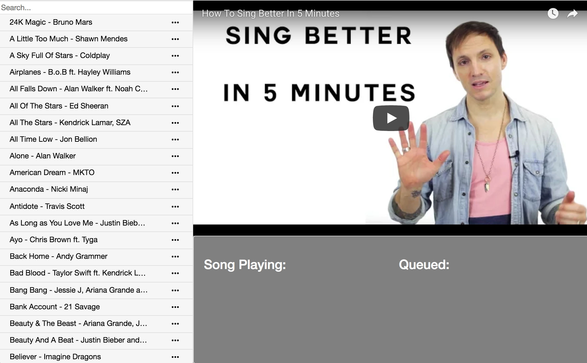
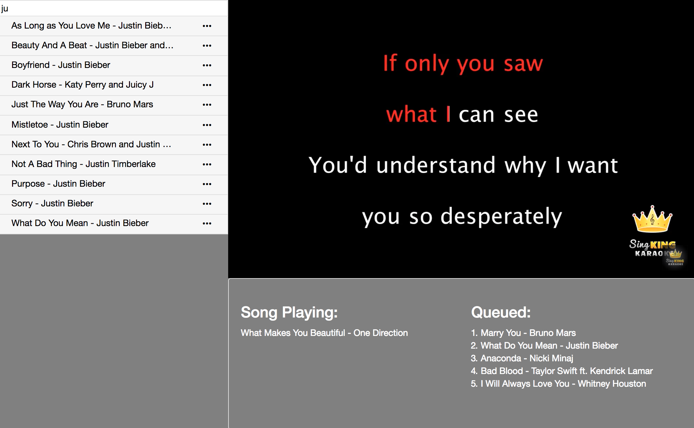

# karaoke
Users are able to search through the song catalogue and queue songs to be played. Karaoke video urls are saved in the database and utilizes the YouTube IFrame Player API to display on the page. The next video automatically plays when the previous one ends and the queue is updated on the page.

The project uses IndexedDB to store song names, artists, and their respective urls on YouTube (song name, song artist, YouTube url).
